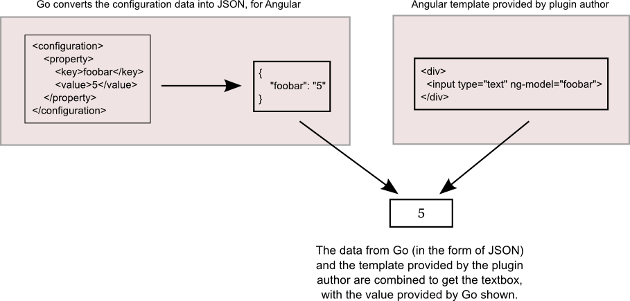

GoCD uses Angular JS as its template engine for the plugin UI. This allows plugin authors to use a limited set of AngularJS features to specify how the UI of their plugins looks.

<aside class='notice'>
  <strong>Note:</strong> Some plugin endpoints, like the Package Repository plugin, do not use this for their view.
</aside>

<div style='clear: both;'></div>

#### Getting started with AngularJS based templates

> Given a configuration:

```xml
<configuration>
  <property>
    <key>username</key>
    <value>alice</username>
  </property>
</configuration>
```

> This gets converted into the following JSON representation in the browser:

```json
{
  "username": "alice"
}
```

> The AngularJS template is expected to bind to the JSON object shown above:

```html
<div class="form_item_block">
  <label>Username:<span class='asterix'>*</span></label>
  <input ng-model="username" />
</div>
```

When an Angular template is used in a Go plugin, to define the configuration UI, the configuration key which is stored in the configuration XML is used everywhere and is expected to be consistent. Since Angular works off of JSON, GoCD will make sure that the key in the JSON provided to the Angular template is the same as the key in the configuration XML.

Suppose the key of the configuration property stored in the XML is "username", with value, "alice", then Go will make sure that the value is available to the template as "username" when used in an Angular-specific HTML attribute like "ng-model".



So, the name "foobar" needs to be the same across the configuration XML, the Angular template as well as in any code that the plugin has.

<div style='clear: both;'></div>

#### Showing validation errors in the UI

> We use some simple string replacement<br/>
> to substitute `GOINPUTNAME` with a unique identifier<br/>
> for your plugin in order to render<br/>
> any server side errors

```html
<div class="form_item_block">
  <label>Username:<span class='asterix'>*</span></label>
  <input ng-model="username" />
  <span class="form_error" ng-show="GOINPUTNAME[username].$error.server">
    {{ GOINPUTNAME[username].$error.server}}
  </span>
</div>
```

In case of validation errors returned by `go.plugin-settings.validate-configuration`, the error messages needs to be populated on the UI, use the snippet here to show the validation errors.
